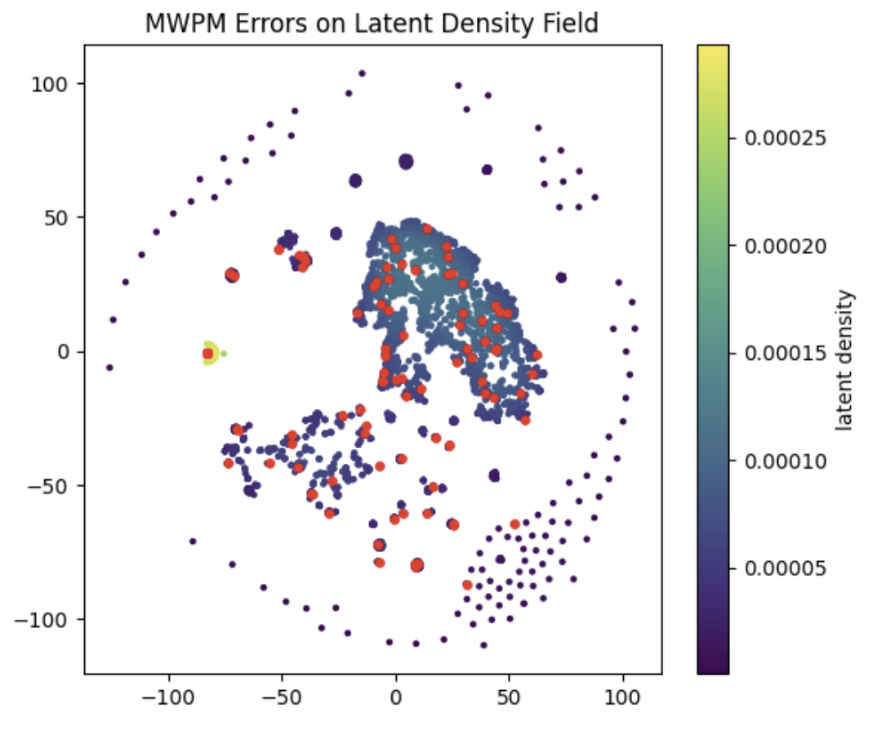
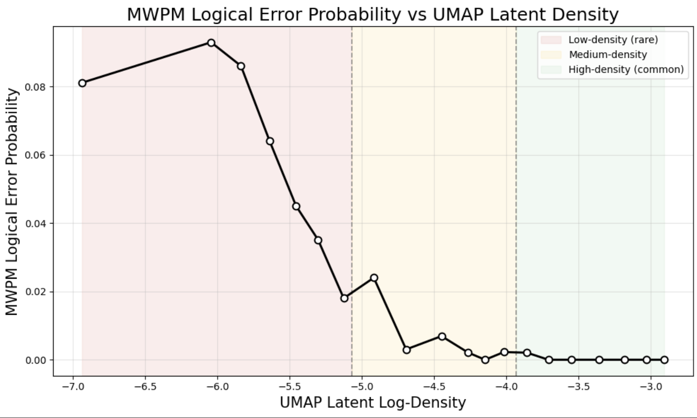

# Syndrome2Vec

Syndrome2Vec is a lightweight analysis toolkit for exploring the **geometric structure of quantum error-correction syndromes**. It is **not a decoder** and does **not modify hardware or stabilizers**—instead it provides a way to **diagnose when and why existing decoders succeed or fail** by studying the geometry of multi-round syndrome data.

## Why Geometry?
Repeated stabilizer measurements are not independent bits; they are **trajectories generated by an underlying physical noise process**. When embedded into a compact latent space, these trajectories organize into a **low-dimensional manifold** whose geometry reflects fault structure, correlations, and decoder reliability.

**Key observations**
- Typical low-weight Pauli-like faults cluster in a **dense interior region**.
- Correlated, high-weight, or atypical faults lie on a **sparse boundary**.
- **MWPM failures localize almost entirely to this low-density boundary**.

This suggests that **latent geometry is an intrinsic, decoder-agnostic indicator of when matching assumptions break down**.

## What This Repository Provides
Tools to **visualize, quantify, and interpret that geometry**:
- Embed multi-round syndrome data into a latent space (UMAP/PCA or your own embeddings)
- Visualize latent geometry
- Estimate local density in latent space
- Quantify decoder error rate as a function of latent density
- Localize decoder failures geometrically

The code is decoder- and code-family agnostic as long as you can export arrays.

## Project Layout
- `s2v/`: analysis utilities for embedding, visualization, and density estimation
- `analyze_syndromes.py`: entry script for running analyses on exported arrays
- `exampleplots/`: example figures generated from sample data

## Getting Started
1. Ensure you have Python 3.9+ and install dependencies:
   ```bash
   pip install -r requirements.txt
   ```
2. Prepare three NumPy arrays (saved as `.npy`):
   ```
   syndromes.npy        # shape: [N, T, D] or [N, T*D]
   decoder_outputs.npy  # shape: [N] (e.g., MWPM predictions)
   logical_labels.npy   # shape: [N] (ground-truth logical outcomes)
   ```
3. Run the analysis script:
   ```bash
   python analyze_syndromes.py \
     --syndromes path/to/syndromes.npy \
     --decoder-outputs path/to/decoder_outputs.npy \
     --logical-labels path/to/logical_labels.npy \
     --outdir results/
   ```
4. Inspect the generated plots in `results/` (latent embeddings, density maps, decoder failure localization, etc.).

No assumptions are made about the code family, decoder, or noise model; the tooling is designed to drop into your existing workflow.

## Example Visualizations



The figure shows a two-dimensional t-SNE projection of the latent representations learned by Syndrome2Vec for multi-round syndrome histories of the rotated surface code. Each point corresponds to a single syndrome shot, and the background shading denotes a kernel-density estimate of the latent distribution, highlighting high-probability interior regions and sparse peripheral zones. Typical low-weight Pauli faults cluster tightly in the central region of the manifold, while rare, correlated, or high-weight faults occupy low-density peripheral regions. Points marked in red indicate cases where minimum-weight perfect matching (MWPM) applies an incorrect logical correction; these failures occur almost exclusively along the manifold boundary, where density drops sharply and geometric curvature increases. This structure provides direct evidence that the latent manifold captures physically meaningful organization of syndrome trajectories and exposes regimes in which MWPM’s independence assumptions break down.



This UMAP provides a quantitative counterpart to the visual manifold structure. By grouping latent embeddings into equal-mass density bins, we obtain a clear statistical profile of decoder performance. MWPM error probability is near zero throughout the high-density interior of the manifold and rises sharply in the lowest-density regions. This confirms that latent density is not merely a visualization artifact but an intrinsic geometric predictor of decoder reliability.

The red–yellow–green regions observed in the latent density maps correspond directly to the operational regimes used by the embedding-gated decoder. High-density regions (green) represent typical low-weight faults and form an ``easy'' regime in which MWPM is nearly optimal. Intermediate-density regions (yellow) lie near the manifold boundary, where ambiguity increases and hybrid decoding is beneficial. Low-density peripheral regions (red) contain rare, correlated fault patterns and coincide almost exactly with MWPM failures, defining a ``weird'' regime in which alternative inference is required. The gating strategy thus emerges directly from the geometry of the learned manifold rather than from heuristic thresholds.

---

## What This Is *Not*
- Not a replacement decoder
- Not a hardware proposal
- Not a stabilizer design
- Not a benchmarking leaderboard

It is a **diagnostic lens** — a way to *see* where fault-tolerant assumptions hold and where they break.

## Reproducibility Philosophy
This repository intentionally contains **analysis code only**. Trained model weights (if used) may be provided privately, retrained by users, or replaced by alternative embeddings. The scientific claim does **not** depend on a specific neural architecture — it depends on the **existence and structure of the manifold**.

## License
Released under the **MIT License**. You are free to use, modify, distribute, and integrate into your own analysis pipelines. Attribution is appreciated but not required.

## Citation
If you find this framework useful, please cite:

> V. Goel, *Syndrome2Vec: Geometric Structure in Quantum Error Syndromes*

## Contact
For questions, discussion, or collaboration:

**Vikram Goel**  
Independent researcher  
Email: goel12133@gapps.uwcsea.edu.sg

---
*The geometry is the signal.*
